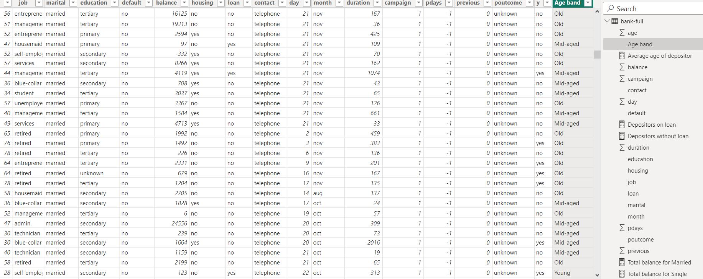
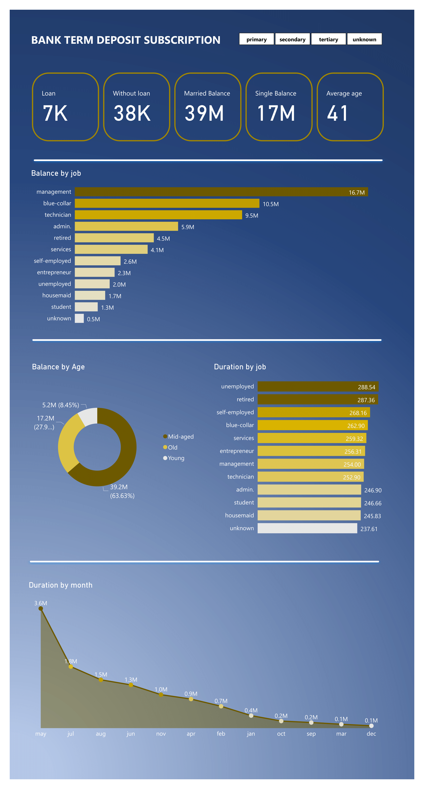

# Power-BI-Bank-term-subscription-details
## INTRODUCTION
This Power BI task involes importing and analysing the **Bank Term Deposit Subscription dataset**, applying some **DAX** functions, creating a conditional column and a dashboard.
## TASK
Using the ‘Bank Term Deposit Subscription’ dataset provided, carryout the following

- Create a measure for the ‘Average age of depositors’
- Create a new column named ‘Age band’ containing the following;
- ‘Young’ for ages below 30
- ‘Mid-aged’ for ages between 30 and 50
- ‘Old’ for ages above 50

Create a measure calculating the total balance for:
- Job: Technician
- Marital: Single and Married
- 
Create a measure to get the number of depositors on Loan

## STEPS
To get the average age of depositor, we apply this DAX query 
Average age of depositor = AVERAGE('bank-full'[age])
Then i proceeded in creating a new conditional column called **Age Band**

